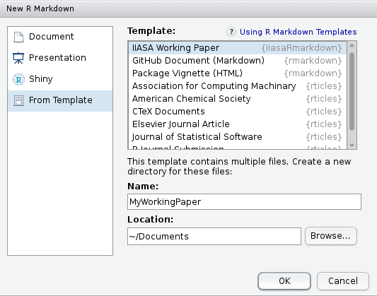

R markdown for IIASA Working Paper
======

[](https://travis-ci.org/iiasa/iiasaRmarkdown) [](http://www.gnu.org/licenses/gpl-3.0.html)

### Installation

To use markdown and the IIASA Working Paper template, please install the following packages: 

1. Install Latex packages according to your operating system, [Linux](https://www.tug.org/texlive/), [Windows](https://www.tug.org/texlive/), or [MacOSX](https://tug.org/mactex/). 

2. Install the universal document converter [pandoc](http://pandoc.org/installing.html). Please, follow the instructions according to the operating system.

3. Open an R terminal and install the R package `devtools` 

```r
install.packages("devtools")
```

4. Use the function `devtools::install_github` to install `iiasaRmarkdown`

```r
devtools::install_github("iiasa/iiasaRmarkdown")
```

### Using R markdown from RStudio

To use **R Markdown** from RStudio:

1. Install the latest [RStudio](http://www.rstudio.com/products/rstudio/download/)

2. Open Rstudio and go to the menu `File/New file/R Markdown...`

 

3. In the **New R Markdown** dialog select the tab `From Template` and the template name `IIASA Working Paper`. **Name** the project, select a **Location**, and click **OK**. 

 

4. To create the PDF click the **knit** button or `Ctrl+Shift+K`
 
 
 
### Using R markdown outside of RStudio

1. Install [pandoc](http://johnmacfarlane.net/pandoc/) using the [instructions for your platform](https://github.com/rstudio/rmarkdown/blob/master/PANDOC.md).

2. Use the function `rmarkdown::draft` to create papers:

```r
rmarkdown::draft(file = "MyWorkingPaper.Rmd", create_dir = TRUE, 
  template = "iiasawp", package = "iiasaRmarkdown")
```
The `Rmd` file will be located in the folder `./MyWorkingPaper/MyWorkingPaper.Rmd`. 

3. Use `rmarkdown::render` to create the PDF 

```r
rmarkdown::render(input = "MyWorkingPaper/MyWorkingPaper.Rmd")
```

For more details see the package [vignette](./inst/doc/iiasaRmarkdown.pdf) and the following web tutorials  [http://rmarkdown.rstudio.com/index.html](http://rmarkdown.rstudio.com/index.html) and [https://guides.github.com/features/mastering-markdown/](https://guides.github.com/features/mastering-markdown/).


